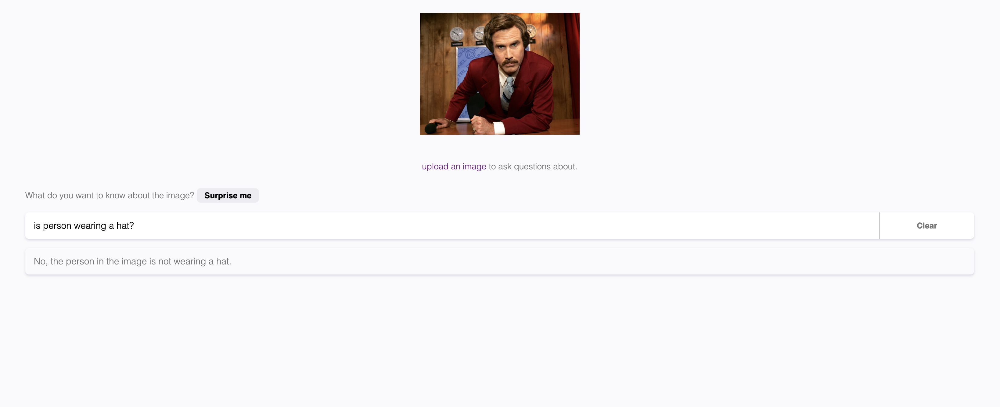

# react-openai-vision-app-acorn

React OpenAI Vision Project.

Uses OpenAI Vision to Analyze image.

For example, upload an image of a person, give OpenAI assitance a prompt like "Is person is wearing a hat?"
The OpenAI assitance would respond to the prompt.

